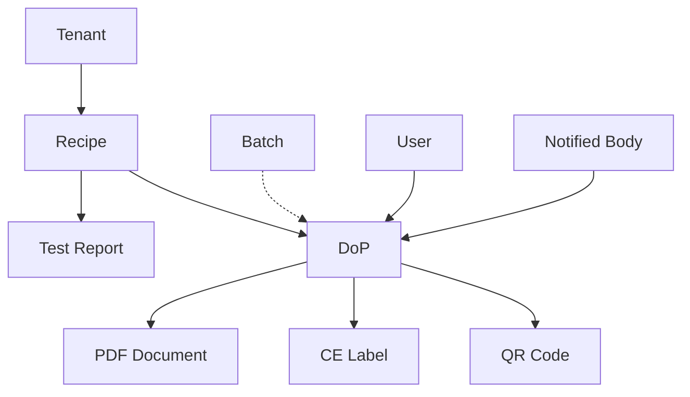

# DOP Files und Datenfluss

## Relevante Dateien

### 1. Frontend/UI Layer

#### Vorhandene Dateien:
- **`/apps/web/app/(auth)/en13813/dops/page.tsx`**
  - DOP-Listenseite mit Tabelle, Filter und Aktionen
  - Verwendet: DataTable, Badge, Button, Card
  - Aktionen: PDF generieren, QR-Code, Veröffentlichen

- **`/apps/web/app/(auth)/en13813/page.tsx`**
  - EN13813 Dashboard mit DOP-Statistiken
  - Zeigt Anzahl der DOPs (gesamt/veröffentlicht)

#### Fehlende Dateien (müssen erstellt werden):
- **`/apps/web/app/(auth)/en13813/dops/new/page.tsx`** ❌
  - DOP-Erstellungsformular
  
- **`/apps/web/app/(auth)/en13813/dops/[id]/page.tsx`** ❌
  - DOP-Detailansicht
  
- **`/apps/web/components/en13813/dops/DoPForm.tsx`** ❌
  - Wiederverwendbare DOP-Formularkomponente

### 2. Backend/Service Layer

#### Kern-Services:
- **`/modules/en13813/services/dop-generator.service.ts`**
  - Hauptservice für alle DOP-Operationen
  - Methoden: createDoP, generatePDF, generateQRCode, updateDoPStatus
  - Enthält TypeScript-Interfaces und Zod-Schemas

- **`/modules/en13813/services/index.ts`**
  - Service-Factory und Export
  - Stellt `createEN13813Services()` bereit

#### Abhängige Services:
- **`/modules/en13813/services/recipe.service.ts`**
  - Rezeptverwaltung (DOPs basieren auf Rezepten)
  
- **`/modules/en13813/services/validation.service.ts`**
  - EN13813-Validierung für Rezepte
  
- **`/modules/en13813/services/pdf-generator.service.ts`**
  - PDF-Erstellung für DOPs und CE-Label
  
- **`/modules/en13813/services/batch.service.ts`**
  - Chargenverwaltung (optional für DOPs)
  
- **`/modules/en13813/services/test-report.service.ts`**
  - Prüfberichte (erforderlich für validierte Rezepte)

### 3. Datenbank Layer

- **`/supabase/migrations/20250117_en13813_base.sql`**
  - Tabellendefinition `en13813_dops`
  - RLS-Policies für Multi-Tenancy
  - Stored Function: `generate_dop_number()`
  - Indizes und Constraints

- **`/modules/en13813/migrations/001_en13813_base.sql`**
  - Modul-Initialisierung
  - Referenziert Haupt-Migration

### 4. Typdefinitionen

- **In `dop-generator.service.ts`:**
  ```typescript
  interface DoP {
    id: string
    tenant_id: string
    recipe_id: string
    dop_number: string
    // ... weitere Felder
  }
  ```

- **`/apps/web/types/database.types.ts`**
  - Generierte Supabase-Typen (via `pnpm gen:types`)

## Datenfluss für DOP-Erstellung

### 1. Vorbereitung
```
Rezept erstellen → Validieren → Prüfbericht → Rezept "validated"
```

### 2. DOP-Erstellung Flow
```
User Interface                Service Layer              Database Layer
     │                             │                           │
     ├─ 1. GET /dops/new ─────────►│                           │
     │                             │                           │
     │◄─ 2. Formular anzeigen ─────┤                           │
     │                             │                           │
     │                             ├─ 3. Validierte Rezepte ──►│
     │                             │       abrufen              │
     │                             │◄─────────────────────────┤
     │                             │                           │
     ├─ 4. Rezept auswählen ──────►│                           │
     │     + Formular absenden     │                           │
     │                             │                           │
     │                             ├─ 5. createDoP() ─────────►│
     │                             │    - generate_dop_number()│
     │                             │    - Insert DOP           │
     │                             │◄─────────────────────────┤
     │                             │                           │
     │◄─ 6. Erfolg/Redirect ───────┤                           │
```

### 3. DOP-Verarbeitung Flow
```
Draft → Genehmigung anfordern → Genehmigen → PDF generieren → Veröffentlichen
  │           │                      │              │               │
  └─ status: 'draft'                 │              │               │
              └─ 'pending_approval' ─┘              │               │
                                    └─ 'approved' ──┘               │
                                                    └─ 'published' ─┘
```

### 4. Datenabhängigkeiten



### 5. API-Aufrufe (Supabase Client)

```typescript
// 1. Validierte Rezepte laden
const { data: recipes } = await supabase
  .from('en13813_recipes')
  .select('*')
  .eq('validation_status', 'validated')
  .eq('tenant_id', tenantId)

// 2. DOP erstellen
const { data: dop } = await supabase
  .rpc('create_en13813_dop', {
    p_recipe_id: recipeId,
    p_manufacturer_info: manufacturerInfo,
    p_user_id: userId
  })

// 3. Status aktualisieren
const { error } = await supabase
  .from('en13813_dops')
  .update({ status: 'pending_approval' })
  .eq('id', dopId)

// 4. PDF generieren (via Service)
await dopService.generatePDF(dopId)
```

### 6. Sicherheit & Validierung

- **RLS (Row Level Security)**: Tenant-Isolation
- **Validierung**: Zod-Schemas in Services
- **Berechtigungen**: Nur validierte Rezepte, nur eigene Tenant-Daten
- **Workflow**: Status-Übergänge validiert

## Implementierungsreihenfolge

1. **DoPForm Component** erstellen
2. **Route /dops/new** implementieren
3. **Formular-Validierung** hinzufügen
4. **Service-Integration** testen
5. **Fehlerbehandlung** implementieren
6. **Success-Flow** mit Redirect