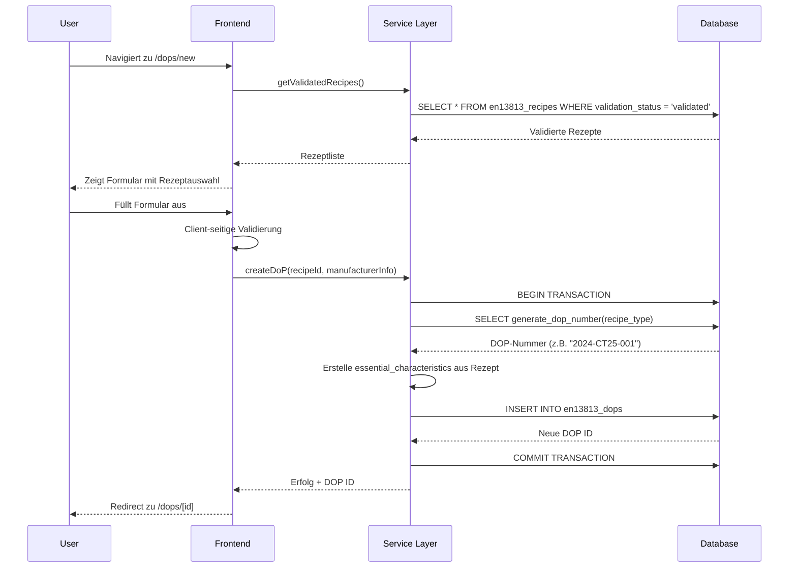
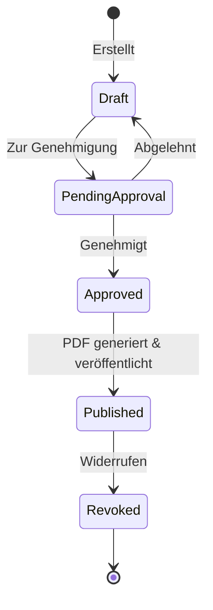

# DOP-Erstellung: Architektur und Datenfluss

## Übersicht

Die DOP (Declaration of Performance / Leistungserklärung) Funktionalität ermöglicht die Erstellung rechtlich bindender Dokumente gemäß EN 13813 für Estrichmörtel. Das System folgt einer Multi-Tier-Architektur mit klarer Trennung zwischen Frontend, Backend-Services und Datenbankschicht.

## Systemarchitektur

```
┌─────────────────────────────────────────────────────────────────┐
│                          Frontend (Next.js)                       │
├─────────────────────────────────────────────────────────────────┤
│  Pages:                           Components:                     │
│  - /en13813/dops (Liste)         - DataTable                    │
│  - /en13813/dops/new ❌          - DoPForm ❌                   │
│  - /en13813/dops/[id] ❌         - StatusBadge                  │
│  - /en13813 (Dashboard)          - ActionButtons                │
└─────────────────────────────────────────────────────────────────┘
                                    │
                                    ▼
┌─────────────────────────────────────────────────────────────────┐
│                    Service Layer (TypeScript)                     │
├─────────────────────────────────────────────────────────────────┤
│  DoPGeneratorService              RecipeService                  │
│  - createDoP()                    - getValidatedRecipes()        │
│  - generatePDF()                  - validateRecipe()             │
│  - generateQRCode()                                              │
│  - updateDoPStatus()              ValidationService              │
│                                   - validateEN13813()            │
│  PDFGeneratorService                                             │
│  - generateDoPPDF()               TestReportService              │
│  - generateCELabel()              - createTestReport()           │
│                                                                   │
│  BatchService                                                    │
│  - linkDoPToBatch()                                              │
└─────────────────────────────────────────────────────────────────┘
                                    │
                                    ▼
┌─────────────────────────────────────────────────────────────────┐
│                    Datenbank (Supabase/PostgreSQL)               │
├─────────────────────────────────────────────────────────────────┤
│  Tabellen:                        Funktionen:                    │
│  - en13813_dops                   - generate_dop_number()        │
│  - en13813_recipes                                               │
│  - en13813_batches                RLS Policies:                  │
│  - en13813_test_reports           - tenant_isolation             │
│  - documents                      - user_permissions             │
│  - en13813_dop_packages                                          │
└─────────────────────────────────────────────────────────────────┘
```

## Datenmodell

### Haupttabelle: `en13813_dops`

```sql
CREATE TABLE en13813_dops (
  id UUID PRIMARY KEY,
  tenant_id UUID NOT NULL,
  recipe_id UUID NOT NULL,
  batch_id UUID,
  dop_number TEXT UNIQUE NOT NULL,    -- Format: "2024-CT25-001"
  version INTEGER DEFAULT 1,
  product_name TEXT NOT NULL,
  intended_use TEXT,
  manufacturer_info JSONB NOT NULL,    -- Herstellerdaten
  declared_performance JSONB NOT NULL, -- Leistungsmerkmale
  status TEXT NOT NULL,               -- Workflow-Status
  prepared_by UUID NOT NULL,
  approved_by UUID,
  approval_date TIMESTAMPTZ,
  issued_at TIMESTAMPTZ,
  expires_at TIMESTAMPTZ,             -- 5 Jahre Gültigkeit
  pdf_document_id UUID,
  ce_label_document_id UUID,
  qr_code TEXT,
  public_url TEXT,
  created_at TIMESTAMPTZ DEFAULT NOW(),
  updated_at TIMESTAMPTZ DEFAULT NOW()
);
```

### JSONB-Strukturen

#### manufacturer_info:
```json
{
  "company_name": "Beispiel GmbH",
  "address": "Musterstraße 1",
  "postal_code": "12345",
  "city": "Musterstadt",
  "country": "Deutschland",
  "phone": "+49 123 456789",
  "email": "info@beispiel.de",
  "website": "www.beispiel.de",
  "authorized_person": {
    "name": "Max Mustermann",
    "position": "Geschäftsführer"
  }
}
```

#### declared_performance:
```json
{
  "essential_characteristics": [
    {
      "characteristic": "Druckfestigkeit",
      "performance": "CT-C25",
      "harmonized_standard": "EN 13813"
    },
    {
      "characteristic": "Biegezugfestigkeit",
      "performance": "F5",
      "harmonized_standard": "EN 13813"
    }
  ],
  "system": "System 3",
  "notified_body": {
    "name": "Materialprüfanstalt",
    "number": "0123"
  }
}
```

## Datenfluss

### 1. DOP-Erstellung (Neuerstellung)



### 2. DOP-Workflow (Genehmigung & Veröffentlichung)



### 3. PDF-Generierung

```
User klickt "PDF generieren"
    │
    ▼
DoPGeneratorService.generatePDF(dopId)
    │
    ├─► Lade DOP-Daten aus DB
    │
    ├─► PDFGeneratorService.generateDoPPDF(dopData)
    │      │
    │      ├─► Erstelle PDF mit Puppeteer
    │      ├─► Füge QR-Code ein
    │      └─► Speichere in Supabase Storage
    │
    ├─► Update DOP mit pdf_document_id
    │
    └─► Return PDF URL
```

### 4. Datenabhängigkeiten

```
Tenant ──┬─► Recipe ──┬─► TestReport
         │            │
         │            └─► DoP ──┬─► PDF Document
         │                      │
         │                      ├─► CE Label
         │                      │
         │                      └─► QR Code
         │
         └─► Batch ─────────────┘
```

## API-Endpunkte (Supabase RPC)

### 1. `generate_dop_number(p_recipe_type TEXT)`
Generiert eindeutige DOP-Nummer im Format YYYY-TYPE-XXX

### 2. Direkte Tabellenzugriffe via Supabase Client:
```typescript
// Rezepte abrufen
supabase.from('en13813_recipes').select('*')

// DOP erstellen
supabase.from('en13813_dops').insert({...})

// DOP aktualisieren
supabase.from('en13813_dops').update({...})

// Dokumente verlinken
supabase.from('documents').insert({...})
```

## Sicherheitskonzept

### 1. Row Level Security (RLS)
- **Tenant-Isolation**: Jeder Benutzer sieht nur Daten seines Tenants
- **Berechtigungen**: Erstellen/Bearbeiten nur für berechtigte Benutzer
- **Workflow-Schutz**: Status-Übergänge validiert

### 2. Validierung
- **Zod-Schemas** für Eingabevalidierung
- **Business Rules** in Services
- **Datenbank-Constraints** als letzte Verteidigungslinie

### 3. Dokumentensicherheit
- **Signierte URLs** für PDF-Zugriff
- **Öffentliche URLs** nur für veröffentlichte DOPs
- **QR-Codes** mit verschlüsselten Daten

## Performance-Optimierungen

### 1. Caching
- Validierte Rezepte werden gecacht
- PDF-Templates vorgerendert
- Statische Daten (Notified Bodies) im Frontend

### 2. Lazy Loading
- Große Listen paginiert
- Dokumente on-demand geladen
- Details erst bei Bedarf abgerufen

### 3. Batch-Operationen
- Mehrere DOPs gleichzeitig erstellen
- Bulk-PDF-Generierung
- Sammel-Veröffentlichung

## Fehlende Implementierungen

### Frontend:
1. **`/dops/new` Route und Page**
2. **`DoPForm` Component**
3. **`/dops/[id]` Detailseite**
4. **Approval-Workflow UI**

### Backend:
1. **Batch-DOP-Erstellung**
2. **Email-Benachrichtigungen**
3. **Versionsverwaltung UI**
4. **Öffentliche Zugriffseite**

## Testdaten-Struktur

### Beispiel-Rezept (Basis für DOP):
```json
{
  "id": "uuid",
  "name": "CT-C25-F5 Fließestrich",
  "recipe_type": "CT",
  "properties": {
    "compressive_strength_class": "C25",
    "flexural_strength_class": "F5",
    "wear_resistance_class": "A22",
    "surface_hardness_class": "SH200"
  },
  "validation_status": "validated",
  "test_report_id": "uuid"
}
```

### Beispiel-DOP:
```json
{
  "dop_number": "2024-CT25-001",
  "product_name": "FlowCrete CT-C25-F5",
  "manufacturer_info": {
    "company_name": "Estrich Meister GmbH",
    "city": "München"
  },
  "declared_performance": {
    "essential_characteristics": [
      {
        "characteristic": "Druckfestigkeit",
        "performance": "C25",
        "harmonized_standard": "EN 13813"
      }
    ]
  },
  "status": "published"
}
```