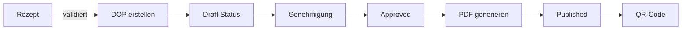

# DOP (Declaration of Performance) Implementation Guide

## Überblick

Die DOP-Funktionalität ermöglicht die Erstellung von Leistungserklärungen gemäß EN 13813 für Estrichmörtel. Das System ist bereits teilweise implementiert mit solider Datenbankstruktur und Services, aber die UI-Layer fehlt noch.

## Aktuelle Implementierung

### 1. Datenstruktur

#### Haupttabelle: `en13813_dops`
```typescript
interface DoP {
  id: string
  tenant_id: string
  recipe_id: string           // Verknüpfung zum Rezept
  batch_id?: string          // Optional: Verknüpfung zur Charge
  dop_number: string         // Format: "2024-CT25-001"
  version: number            // Versionskontrolle
  product_name: string
  intended_use: string       // Standard: "Estrichmörtel für die Verwendung..."
  manufacturer_info: {       // JSONB
    company_name: string
    address: string
    postal_code: string
    city: string
    country: string
    phone?: string
    email?: string
    website?: string
    authorized_person: {
      name: string
      position: string
    }
  }
  declared_performance: {    // JSONB
    essential_characteristics: {
      characteristic: string
      performance: string
      harmonized_standard: string
    }[]
    system: string          // System 3
    notified_body: {
      name: string
      number: string
    }
  }
  status: 'draft' | 'pending_approval' | 'approved' | 'published' | 'revoked'
  prepared_by: string       // User ID
  approved_by?: string      // User ID
  approval_date?: Date
  issued_at?: Date
  expires_at?: Date         // 5 Jahre Gültigkeit
  pdf_document_id?: string  // Referenz zum generierten PDF
  ce_label_document_id?: string
  qr_code?: string         // QR-Code Daten
  public_url?: string      // Öffentlicher Zugriff
}
```

### 2. Vorhandene Services

#### DoPGeneratorService (`/modules/en13813/services/dop-generator.service.ts`)
- **createDoP(recipeId, userId)** - Erstellt neue DOP aus validiertem Rezept
- **generatePDF(dopId)** - Generiert PDF-Dokument
- **generateQRCode(dopId)** - Erstellt QR-Code für digitalen Zugriff
- **updateDoPStatus(dopId, status, userId)** - Workflow-Management
- **createNewVersion(dopId)** - Versionskontrolle
- **generateCELabel(dopId)** - CE-Kennzeichnung

### 3. Implementierte Features

#### Funktionierend:
- ✅ Datenbank-Schema vollständig
- ✅ Service-Layer implementiert
- ✅ TypeScript-Typen definiert
- ✅ DOP-Listenseite (`/en13813/dops`)
- ✅ PDF-Generierung
- ✅ QR-Code-Generierung
- ✅ Validierungslogik

#### Fehlend:
- ❌ DOP-Erstellungsseite (`/en13813/dops/new`)
- ❌ DOP-Formular-Komponente
- ❌ DOP-Detailansicht (`/en13813/dops/[id]`)
- ❌ DOP-Bearbeitungsfunktion
- ❌ Öffentliche Zugriffseite
- ❌ Batch-DOP-Generierung

### 4. Workflow



### 5. Verwendete Komponenten

#### UI-Komponenten:
- `DataTable` - Für Listenansicht
- `Button`, `Badge` - UI-Elemente
- `Card` - Layout
- `Form` - Noch nicht für DOPs implementiert

#### Hooks:
- `useSupabase` - Datenbankzugriff
- `useAuth` - Benutzerauthentifizierung
- `useToast` - Benachrichtigungen

### 6. API-Struktur

Das System nutzt:
- Supabase Client-SDK für Datenbankoperationen
- RPC-Funktionen: `generate_dop_number`
- Row Level Security (RLS) für Multi-Tenancy

### 7. Validierung

#### Geschäftsregeln:
1. Rezept muss validiert sein vor DOP-Erstellung
2. Herstellerinformationen müssen vollständig sein
3. Wesentliche Merkmale aus Rezept übernommen
4. Versionskontrolle bei Änderungen
5. Genehmigungsworkflow einhalten

### 8. Datengenerierung

#### DOP-Nummer Format:
- `YYYY-TYPE-XXX`
- Beispiel: `2024-CT25-001`
- TYPE basiert auf Estrichtyp (CT, CA, CAF)
- Fortlaufende Nummerierung

#### Wesentliche Merkmale:
Automatisch aus Rezepteigenschaften generiert:
- Druckfestigkeit
- Biegezugfestigkeit  
- Verschleißwiderstand
- Oberflächenhärte
- Brandverhalten
- pH-Wert
- Wärmeleitfähigkeit

## Implementierungsplan für `/en13813/dops/new`

### 1. Route erstellen
```typescript
// app/(auth)/en13813/dops/new/page.tsx
```

### 2. Formular-Komponente
```typescript
// components/en13813/dops/DoPForm.tsx
```

### 3. Benötigte Daten:
- Liste validierter Rezepte zur Auswahl
- Herstellerinformationen (aus Tenant-Profil)
- Benannte Stelle (Notified Body) Informationen

### 4. Formularfelder:
1. **Rezeptauswahl** (Dropdown)
2. **Produktname** (automatisch aus Rezept)
3. **Verwendungszweck** (vorbefüllt, editierbar)
4. **Herstellerangaben** (vorbefüllt aus Profil)
5. **Autorisierte Person** (Name, Position)
6. **Gültigkeitsdauer** (Standard: 5 Jahre)

### 5. Aktionen:
- Entwurf speichern
- Zur Genehmigung einreichen
- Vorschau anzeigen

## Technische Hinweise

### Supabase-Abfragen:
```typescript
// Validierte Rezepte abrufen
const { data: recipes } = await supabase
  .from('en13813_recipes')
  .select('*')
  .eq('validation_status', 'validated')

// DOP erstellen
const { data: dop } = await supabase
  .from('en13813_dops')
  .insert({...})
  .select()
  .single()
```

### Fehlerbehandlung:
- Validierung vor Absenden
- Fehlermeldungen anzeigen
- Rollback bei Fehlern

### Performance:
- Lazy Loading für große Listen
- Optimistische Updates
- Caching von Stammdaten