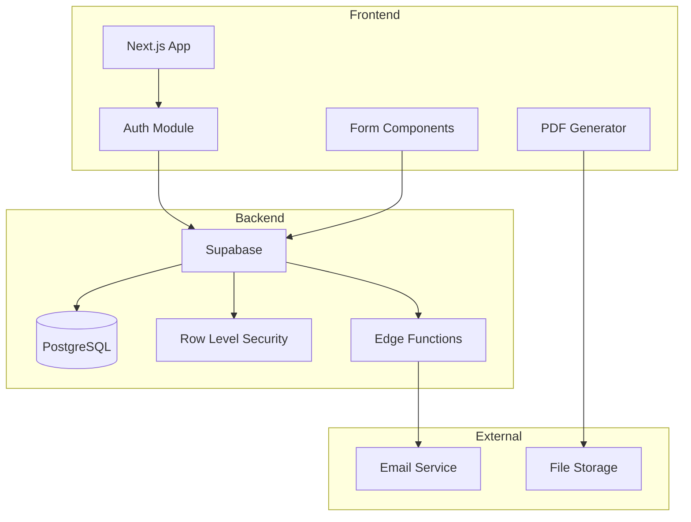

# Systemarchitektur EN 13813 Konformitätssystem

## Systemübersicht

## Hauptkomponenten

### 1. Frontend (Next.js)
- **App Router:** Dateibasiertes Routing mit Layout-System
- **Komponenten:** 
  - RecipeForm: Rezepturverwaltung mit Normbezeichnung
  - TestPlanGenerator: ITT-Prüfplanung
  - DOPGenerator: Leistungserklärung-Erstellung
  - QCDashboard: Chargenüberwachung
- **State:** React Query für Server-State, lokaler State via Hooks

### 2. Datenbank (PostgreSQL)
- **Kern-Tabellen:**
  - `recipes`: Rezepturen mit Zusammensetzung
  - `test_reports`: Prüfberichte mit Messwerten
  - `batches`: Chargenproduktion
  - `dops`: Generierte Leistungserklärungen
- **RLS-Policies:** Mandantenfähigkeit über `organization_id`

### 3. Geschäftslogik
- **Services:**
  - NormDesignationService: EN 13813 Klassifizierung
  - ConformityAssessmentService: System 2+ Bewertung
  - FPCService: Werkseigene Produktionskontrolle
  - PDFGeneratorService: Dokumentenerstellung

## Datenflüsse

### Login-Flow
1. Benutzer gibt Credentials ein
2. Supabase Auth validiert
3. JWT-Token wird gesetzt
4. RLS-Policies greifen basierend auf User-Claims

### Rezeptur-CRUD
1. Formular validiert Eingaben (Zod-Schema)
2. API-Call an Supabase
3. RLS prüft Berechtigungen
4. Datenbank-Operation
5. Cache-Invalidierung via React Query
6. UI-Update

### DoP-Generierung
1. Rezeptur + Prüfberichte laden
2. Konformität berechnen (Min/Max/Mittelwerte)
3. PDF generieren (jsPDF)
4. Speichern in Supabase Storage
5. Referenz in DB ablegen

## Nichtfunktionale Ziele

### Performance
- **LCP:** < 2.5s
- **API Response:** < 200ms (p95)
- **PDF-Generierung:** < 3s

### Verfügbarkeit
- **Uptime:** 99.9%
- **RTO:** 4h
- **RPO:** 1h

### Sicherheit
- **Auth:** JWT-basiert mit Refresh-Tokens
- **Autorisierung:** Row Level Security
- **Verschlüsselung:** TLS 1.3, AES-256 für Storage
- **OWASP:** Top 10 Compliance

## Externe Dienste

### Authentifizierung
- **Provider:** Supabase Auth
- **MFA:** TOTP-basiert
- **SSO:** Optional via SAML 2.0

### E-Mail
- **Service:** Resend (via Supabase Edge Functions)
- **Templates:** React Email
- **Use Cases:** Registrierung, Passwort-Reset, DoP-Versand

### File Storage
- **Service:** Supabase Storage
- **Buckets:** 
  - `dops`: Leistungserklärungen
  - `test-reports`: Prüfberichte
  - `attachments`: Allgemeine Anhänge

### Analytics
- **Service:** Vercel Analytics
- **Metriken:** Web Vitals, Custom Events
- **Datenschutz:** Cookie-less Tracking

## Trade-offs & Constraints

### Multi-Tenant Architektur
- **Pro:** Kosteneffizienz, zentrale Wartung
- **Contra:** Komplexere RLS-Policies
- **Entscheidung:** Soft-Tenancy via `organization_id`

### Edge Functions Limits
- **Constraint:** 10s Timeout, 2MB Payload
- **Lösung:** Async-Jobs für große PDFs

### Normkonformität
- **Constraint:** EN 13813:2002 Vorgaben
- **Lösung:** Strikte Validierung, Audit-Log

### Skalierung
- **Constraint:** Supabase Free-Tier Limits
- **Lösung:** Vorbereitung für Pro-Tier Migration