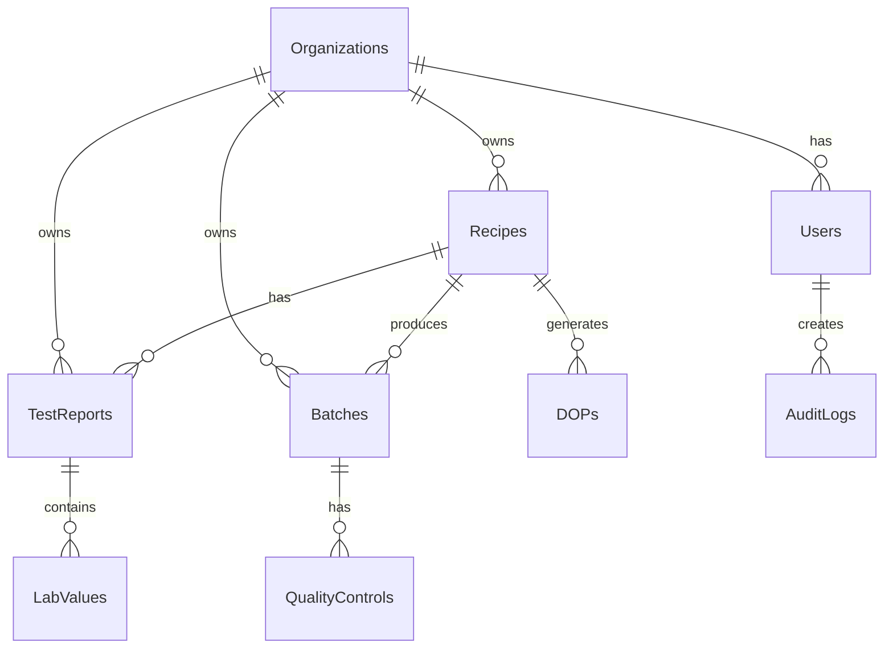

# Backend & Datenbank-Dokumentation

## Datenmodell

### ERD (Entity Relationship Diagram)


### Zentrale Tabellen

#### organizations
```sql
CREATE TABLE organizations (
  id UUID PRIMARY KEY DEFAULT gen_random_uuid(),
  name VARCHAR(255) NOT NULL,
  address JSONB,
  notified_body_number VARCHAR(10),
  created_at TIMESTAMPTZ DEFAULT NOW(),
  updated_at TIMESTAMPTZ DEFAULT NOW()
);
```

#### recipes
```sql
CREATE TABLE recipes (
  id UUID PRIMARY KEY DEFAULT gen_random_uuid(),
  organization_id UUID REFERENCES organizations(id),
  name VARCHAR(255) NOT NULL,
  designation VARCHAR(50), -- z.B. "CT-C25-F4"
  binder_type VARCHAR(10), -- CT, CA, CAF, SR
  strength_class VARCHAR(10),
  surface_hardness VARCHAR(10),
  wear_resistance VARCHAR(10),
  composition JSONB, -- Detaillierte Zusammensetzung
  active BOOLEAN DEFAULT true,
  created_at TIMESTAMPTZ DEFAULT NOW(),
  updated_at TIMESTAMPTZ DEFAULT NOW(),
  
  INDEX idx_recipes_organization (organization_id),
  INDEX idx_recipes_designation (designation)
);
```

#### test_reports
```sql
CREATE TABLE test_reports (
  id UUID PRIMARY KEY DEFAULT gen_random_uuid(),
  organization_id UUID REFERENCES organizations(id),
  recipe_id UUID REFERENCES recipes(id),
  report_number VARCHAR(50) UNIQUE,
  test_type VARCHAR(20), -- ITT, FPC, Audit
  test_date DATE NOT NULL,
  compressive_strength DECIMAL(5,2),
  flexural_strength DECIMAL(5,2),
  wear_resistance_value DECIMAL(5,2),
  surface_hardness_value DECIMAL(5,2),
  status VARCHAR(20) DEFAULT 'draft',
  approved_by UUID REFERENCES users(id),
  approved_at TIMESTAMPTZ,
  created_at TIMESTAMPTZ DEFAULT NOW(),
  
  INDEX idx_test_reports_recipe (recipe_id),
  INDEX idx_test_reports_date (test_date)
);
```

#### dops (Declaration of Performance)
```sql
CREATE TABLE dops (
  id UUID PRIMARY KEY DEFAULT gen_random_uuid(),
  organization_id UUID REFERENCES organizations(id),
  recipe_id UUID REFERENCES recipes(id),
  dop_number VARCHAR(50) UNIQUE,
  version INTEGER DEFAULT 1,
  issue_date DATE NOT NULL,
  essential_characteristics JSONB,
  pdf_url TEXT,
  qr_code TEXT,
  valid_until DATE,
  status VARCHAR(20) DEFAULT 'draft',
  created_at TIMESTAMPTZ DEFAULT NOW(),
  
  INDEX idx_dops_recipe (recipe_id),
  INDEX idx_dops_number (dop_number)
);
```

### Relationale Beziehungen

#### 1:N Beziehungen
- Organization → Recipes
- Organization → Users
- Recipe → TestReports
- Recipe → Batches
- TestReport → LabValues

#### N:M Beziehungen
- Users ↔ Roles (via user_roles)
- Recipes ↔ RawMaterials (via recipe_materials)

## Auth-/Rollenmodell

### Rollen-Hierarchie
```
Super Admin
  ├── Organization Admin
  │   ├── QS Manager
  │   ├── Lab Technician
  │   └── Production Manager
  └── Viewer
```

### Berechtigungen
```typescript
enum Permission {
  // Recipes
  RECIPE_VIEW = 'recipe.view',
  RECIPE_CREATE = 'recipe.create',
  RECIPE_EDIT = 'recipe.edit',
  RECIPE_DELETE = 'recipe.delete',
  
  // Test Reports
  TEST_REPORT_VIEW = 'test_report.view',
  TEST_REPORT_CREATE = 'test_report.create',
  TEST_REPORT_APPROVE = 'test_report.approve',
  
  // DOPs
  DOP_VIEW = 'dop.view',
  DOP_GENERATE = 'dop.generate',
  DOP_PUBLISH = 'dop.publish',
  
  // Admin
  USER_MANAGE = 'user.manage',
  ORGANIZATION_MANAGE = 'organization.manage',
}
```

### JWT Claims
```json
{
  "sub": "user-uuid",
  "email": "user@example.com",
  "organization_id": "org-uuid",
  "role": "qs_manager",
  "permissions": ["recipe.view", "recipe.edit", "test_report.create"],
  "exp": 1234567890
}
```

## RLS-Policies

### Multi-Tenant Isolation
```sql
-- Basis-Policy für organization_id
CREATE POLICY "Users can only see their organization's data"
ON recipes
FOR SELECT
USING (organization_id = auth.jwt() ->> 'organization_id');

-- Erweiterte Policy mit Rollen
CREATE POLICY "QS Managers can edit recipes"
ON recipes
FOR UPDATE
USING (
  organization_id = auth.jwt() ->> 'organization_id'
  AND 
  auth.jwt() ->> 'role' IN ('qs_manager', 'admin')
);
```

### Beispiel-Policies

#### Recipes
```sql
-- View Policy
CREATE POLICY "view_recipes" ON recipes
  FOR SELECT USING (
    organization_id = auth.jwt() ->> 'organization_id'
  );

-- Insert Policy
CREATE POLICY "create_recipes" ON recipes
  FOR INSERT WITH CHECK (
    organization_id = auth.jwt() ->> 'organization_id'
    AND has_permission('recipe.create')
  );

-- Update Policy
CREATE POLICY "update_recipes" ON recipes
  FOR UPDATE USING (
    organization_id = auth.jwt() ->> 'organization_id'
    AND has_permission('recipe.edit')
  );

-- Delete Policy
CREATE POLICY "delete_recipes" ON recipes
  FOR DELETE USING (
    organization_id = auth.jwt() ->> 'organization_id'
    AND has_permission('recipe.delete')
  );
```

#### Test Reports (mit Approval-Workflow)
```sql
-- Draft können vom Ersteller bearbeitet werden
CREATE POLICY "edit_own_draft_reports" ON test_reports
  FOR UPDATE USING (
    organization_id = auth.jwt() ->> 'organization_id'
    AND created_by = auth.uid()
    AND status = 'draft'
  );

-- Nur QS Manager können approven
CREATE POLICY "approve_test_reports" ON test_reports
  FOR UPDATE USING (
    organization_id = auth.jwt() ->> 'organization_id'
    AND has_permission('test_report.approve')
  )
  WITH CHECK (
    status IN ('approved', 'rejected')
  );
```

## Migrations-Workflow

### Naming Convention
```
YYYYMMDD_HHMMSS_description.sql
20250102_143022_add_batch_tracking.sql
```

### Migration erstellen
```bash
# Neue Migration
npx supabase migration new add_batch_tracking

# Migration schreiben
cat > supabase/migrations/20250102_143022_add_batch_tracking.sql << EOF
-- Up Migration
CREATE TABLE batches (
  id UUID PRIMARY KEY DEFAULT gen_random_uuid(),
  recipe_id UUID REFERENCES recipes(id),
  batch_number VARCHAR(50) UNIQUE,
  production_date DATE NOT NULL,
  quantity DECIMAL(10,2),
  created_at TIMESTAMPTZ DEFAULT NOW()
);

-- Down Migration (im Kommentar für Dokumentation)
-- DROP TABLE batches;
EOF
```

### Migration ausführen
```bash
# Lokal
npx supabase db reset  # Vorsicht: Löscht alle Daten!
npx supabase migration up

# Production
npx supabase db push --linked
```

### Rollback-Strategie
```sql
-- Backup vor Migration
pg_dump $DATABASE_URL > backup_$(date +%Y%m%d_%H%M%S).sql

-- Rollback
psql $DATABASE_URL < backup_20250102_143022.sql
```

## Jobs/Queues/Webhooks

### Background Jobs (via pg_cron)
```sql
-- Tägliche Bereinigung alter Drafts
SELECT cron.schedule(
  'cleanup-old-drafts',
  '0 2 * * *', -- Täglich um 2 Uhr
  $$
  DELETE FROM test_reports 
  WHERE status = 'draft' 
  AND created_at < NOW() - INTERVAL '30 days';
  $$
);

-- Monatliche Statistik-Aggregation
SELECT cron.schedule(
  'monthly-statistics',
  '0 0 1 * *', -- Monatlich am 1.
  $$
  INSERT INTO monthly_statistics (month, organization_id, metrics)
  SELECT 
    DATE_TRUNC('month', CURRENT_DATE - INTERVAL '1 month'),
    organization_id,
    jsonb_build_object(
      'total_batches', COUNT(*),
      'avg_strength', AVG(compressive_strength)
    )
  FROM test_reports
  WHERE test_date >= DATE_TRUNC('month', CURRENT_DATE - INTERVAL '1 month')
  GROUP BY organization_id;
  $$
);
```

### Webhooks
```typescript
// Edge Function für Webhook-Verarbeitung
export async function handleWebhook(req: Request) {
  const signature = req.headers.get('x-webhook-signature');
  const body = await req.text();
  
  // Signatur verifizieren
  if (!verifySignature(body, signature)) {
    return new Response('Invalid signature', { status: 401 });
  }
  
  const event = JSON.parse(body);
  
  // Idempotenz-Check
  const idempotencyKey = req.headers.get('x-idempotency-key');
  if (await hasProcessed(idempotencyKey)) {
    return new Response('Already processed', { status: 200 });
  }
  
  // Event verarbeiten
  switch (event.type) {
    case 'test_report.approved':
      await sendApprovalNotification(event.data);
      break;
    case 'dop.generated':
      await triggerCEMarkingUpdate(event.data);
      break;
  }
  
  // Als verarbeitet markieren
  await markProcessed(idempotencyKey);
  
  return new Response('OK', { status: 200 });
}
```

### Retry-Mechanismus
```typescript
// utils/retry.ts
export async function withRetry<T>(
  fn: () => Promise<T>,
  options = { maxAttempts: 3, delay: 1000 }
): Promise<T> {
  let lastError: Error;
  
  for (let i = 0; i < options.maxAttempts; i++) {
    try {
      return await fn();
    } catch (error) {
      lastError = error as Error;
      
      if (i < options.maxAttempts - 1) {
        await new Promise(resolve => 
          setTimeout(resolve, options.delay * Math.pow(2, i))
        );
      }
    }
  }
  
  throw lastError!;
}
```

## Performance-Optimierungen

### Indizes
```sql
-- Häufige Queries optimieren
CREATE INDEX idx_test_reports_org_date 
ON test_reports(organization_id, test_date DESC);

CREATE INDEX idx_recipes_active_org 
ON recipes(organization_id, active) 
WHERE active = true;

-- Full-Text Search
CREATE INDEX idx_recipes_search 
ON recipes USING gin(to_tsvector('german', name || ' ' || designation));
```

### Materialized Views
```sql
-- Aggregierte Statistiken
CREATE MATERIALIZED VIEW recipe_statistics AS
SELECT 
  r.id,
  r.name,
  COUNT(tr.id) as test_count,
  AVG(tr.compressive_strength) as avg_strength,
  MAX(tr.test_date) as last_test_date
FROM recipes r
LEFT JOIN test_reports tr ON r.id = tr.recipe_id
GROUP BY r.id, r.name;

-- Refresh Schedule
CREATE OR REPLACE FUNCTION refresh_recipe_statistics()
RETURNS void AS $$
BEGIN
  REFRESH MATERIALIZED VIEW CONCURRENTLY recipe_statistics;
END;
$$ LANGUAGE plpgsql;

SELECT cron.schedule('refresh-stats', '*/15 * * * *', 
  'SELECT refresh_recipe_statistics()');
```

### Query-Optimierung
```typescript
// Nutze Prepared Statements
const getRecipeWithReports = `
  SELECT 
    r.*,
    COALESCE(
      json_agg(
        json_build_object(
          'id', tr.id,
          'test_date', tr.test_date,
          'compressive_strength', tr.compressive_strength
        ) ORDER BY tr.test_date DESC
      ) FILTER (WHERE tr.id IS NOT NULL),
      '[]'
    ) as test_reports
  FROM recipes r
  LEFT JOIN test_reports tr ON r.id = tr.recipe_id
  WHERE r.id = $1
  GROUP BY r.id
`;
```