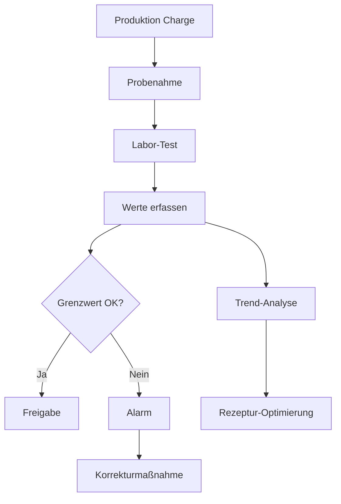

# Prüfberichte & Laborwerte - Feature-Dokumentation

## 🎯 Executive Summary
Prüfberichte und Laborwerte sind die zwei kritischsten Erweiterungen nach dem MVP, da sie direkte rechtliche und qualitative Auswirkungen auf die DOP-Erstellung haben und erhebliche Zeitersparnisse bringen.

---

## 📋 1. PRÜFBERICHTE (ITT & FPC)

### Was sind Prüfberichte?
Prüfberichte dokumentieren die **Erstprüfung (ITT - Initial Type Testing)** und **werkseigene Produktionskontrolle (FPC - Factory Production Control)** gemäß EN 13813. Diese sind **rechtlich verpflichtend** für die CE-Kennzeichnung.

### Was sollte abgedeckt werden?

#### Kern-Funktionalitäten:
```
✅ ITT-Prüfberichte erfassen
   - Prüfdatum
   - Prüfinstitut / Labor
   - Prüfnummer / Referenz
   - Geprüfte Eigenschaften (Druckfestigkeit, Biegezugfestigkeit, etc.)
   - Messwerte und Klassen
   - PDF-Upload des Original-Prüfberichts
   - Verknüpfung zur Rezeptur

✅ FPC-Dokumentation
   - Regelmäßige Eigenüberwachung
   - Produktionskontrollen
   - Checklisten für tägliche/wöchentliche Kontrollen
   - Abweichungsmanagement

✅ Automatische Validierung
   - Prüfung ob ITT-Werte mit Rezeptur-Deklaration übereinstimmen
   - Warnung bei Abweichungen
   - Ablaufdatum-Tracking (ITT gilt 5 Jahre)
```

### Warum benötigen wir das?

#### Rechtliche Gründe:
- **EN 13813 fordert ITT-Nachweis** für jede Rezeptur
- **Haftungsschutz** bei Schadensfällen
- **Audit-Sicherheit** bei Kontrollen
- **Marktüberwachung** kann jederzeit Nachweise fordern

#### Praktische Pain Points die gelöst werden:
- ❌ **"Wo ist der ITT-Bericht von Rezeptur X?"** → Suche in Ordnern/E-Mails
- ❌ **"Ist der ITT noch gültig?"** → Manuelle Datumsprüfung
- ❌ **"Stimmen die Werte noch?"** → Manueller Abgleich
- ❌ **DOP ohne gültigen ITT erstellt** → Rechtliches Risiko

### Funktionsweise:


### Vorteile:

| Vorteil | Beschreibung | Zeitersparnis |
|---------|--------------|---------------|
| **Zentrale Ablage** | Alle Prüfberichte an einem Ort | 30 Min/Woche |
| **Automatische Verknüpfung** | Rezeptur ↔ ITT ↔ DOP | 15 Min/DOP |
| **Ablauf-Warnung** | Rechtzeitige Benachrichtigung vor ITT-Ablauf | Vermeidet Produktionsstopp |
| **Compliance-Nachweis** | Lückenlose Dokumentation für Audits | 2 Tage/Audit |
| **Fehlerreduzierung** | Keine DOPs ohne gültigen ITT | Vermeidet Haftungsfälle |

---

## 🧪 2. LABORWERTE

### Was sind Laborwerte?
Kontinuierliche Messergebnisse aus der laufenden Produktion zur Qualitätssicherung und Prozessoptimierung.

### Was sollte abgedeckt werden?

#### Kern-Funktionalitäten:
```
✅ Messwert-Erfassung
   - Datum/Uhrzeit der Probenahme
   - Charge/Produktionslauf
   - Gemessene Parameter:
     * Druckfestigkeit (7, 28 Tage)
     * Biegezugfestigkeit
     * Konsistenz/Ausbreitmaß
     * Rohdichte
     * pH-Wert
     * Temperatur
   - Soll-/Ist-Vergleich
   - Toleranzbereich-Prüfung

✅ Trend-Analyse
   - Zeitverlauf-Diagramme
   - Mittelwerte & Standardabweichung
   - Ausreißer-Erkennung
   - Chargen-Vergleich

✅ Alarm-System
   - Grenzwert-Überschreitung
   - Trend-Warnungen
   - E-Mail-Benachrichtigung
```

### Warum benötigen wir das?

#### Qualitätssicherung:
- **Frühwarnsystem** bei Qualitätsproblemen
- **Prozessoptimierung** durch Datenanalyse
- **Reklamationsmanagement** mit Nachweisen
- **Kontinuierliche Verbesserung** der Rezepturen

#### Praktische Pain Points die gelöst werden:
- ❌ **"Die letzten 3 Chargen hatten zu niedrige Festigkeit"** → Zu spät erkannt
- ❌ **"Warum schwanken unsere Werte?"** → Keine Daten zur Analyse
- ❌ **"Kunde reklamiert Festigkeit"** → Keine Produktionsdaten
- ❌ **Excel-Chaos** → Jeder Mitarbeiter andere Tabelle

### Funktionsweise:



### Vorteile:

| Vorteil | Beschreibung | Impact |
|---------|--------------|--------|
| **Qualitätssteigerung** | Konstante Überwachung = konstante Qualität | -70% Reklamationen |
| **Kostensenkung** | Früherkennung = weniger Ausschuss | -20% Materialkosten |
| **Prozess-Optimierung** | Datenbasierte Entscheidungen | +15% Effizienz |
| **Kundenvertrauen** | Lückenlose QS-Dokumentation | +Reputation |
| **Normkonformität** | FPC-Anforderungen erfüllt | Audit-sicher |

---

## 💰 ROI-Berechnung

### Zeitersparnis pro Monat:
- Prüfbericht-Suche: **8 Stunden**
- Laborwert-Dokumentation: **12 Stunden**
- Audit-Vorbereitung: **16 Stunden**
- **Gesamt: 36 Stunden/Monat**

### Risikovermeidung:
- Vermiedene fehlerhafte DOPs: **2-3 pro Jahr**
- Vermiedene Produktionsstopps: **1-2 pro Jahr**
- Rechtliche Absicherung: **unbezahlbar**

---

## 🚀 Implementierungs-Roadmap

### Phase 1: Prüfberichte (3 Tage)
```
Tag 1: Datenmodell & API
Tag 2: Upload & Validierung
Tag 3: UI & Verknüpfung zu Rezepturen
```

### Phase 2: Laborwerte (3 Tage)
```
Tag 1: Messwert-Erfassung
Tag 2: Grenzwert-Prüfung & Alarme
Tag 3: Trend-Analyse & Charts
```

### Phase 3: Integration (1 Tag)
```
- Dashboard-Widgets
- Export-Funktionen
- Benachrichtigungen
```

---

## 🎯 Fazit

**Prüfberichte** und **Laborwerte** sind keine "nice-to-have" Features, sondern lösen konkrete, tägliche Probleme:

1. **Rechtssicherheit** durch lückenlose ITT-Dokumentation
2. **Qualitätssicherung** durch kontinuierliche Überwachung
3. **Zeitersparnis** durch Automatisierung
4. **Fehlerreduzierung** durch Validierung
5. **Wettbewerbsvorteil** durch professionelle QS

**Empfehlung:** Nach dem MVP sollten diese beiden Features höchste Priorität haben, da sie den größten Mehrwert bei überschaubarem Aufwand (1 Woche) bieten.